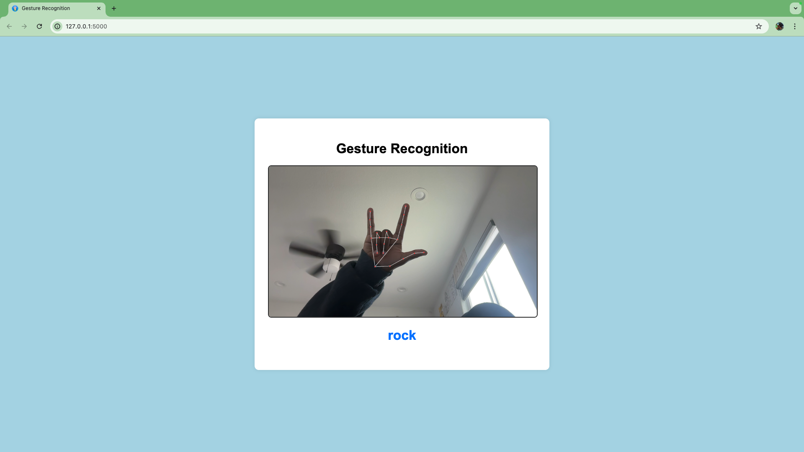

# Gesture Recognition Web App

This project implements a gesture recognition system using a pre-trained ResNeXt50 model, integrated into a Flask web application. The application utilizes webcam input to capture images and predict gestures.



## Table of Contents

- [Overview](#overview)
- [Features](#features)
- [Technologies Used](#technologies-used)
- [Getting Started](#getting-started)
- [Usage](#usage)
- [Credits](#credits)
- [License](#license)

## Overview

This project provides a simple interface to recognize hand gestures using a webcam. The web app captures images and uses a machine learning model to predict gestures in real-time. It is inspired by existing web applications that perform similar tasks.

## Features

- Real-time gesture recognition using webcam input.
- Supports multiple hand gestures.
- User-friendly web interface.

## Technologies Used

- **Flask**: A micro web framework for Python.
- **PyTorch**: An open-source machine learning library used for training and inference of the model.
- **OpenCV**: For handling image capture and processing (if used).
- **PIL**: Python Imaging Library to handle image transformations.

## Getting Started

To run this project locally, follow these steps:

### Prerequisites

Make sure you have the following installed:

- Python 3.6 or higher
- pip (Python package installer)

### Installation

1. Clone this repository:

   ```bash
   git clone https://github.com/varunpalanisamy/Gesture-Recognition-Web-App.git
   cd Gesture-Recognition-Web-App

2. Create a virtual environment (optional but recommended):

   ```bash
   python3 -m venv env
   source env/bin/activate  # On Windows use `env\Scripts\activate`
3. Install the required packages:

   ```bash
   pip install -r requirements.txt
   
4. Download the pre-trained model weights and save them as resnext50.pth in the Gesture-Recognition-Web-App directory.
Download here: https://drive.google.com/file/d/16cwCjHddpO75W7O3XYQmDygB149iPIhP/view?usp=sharing


### Running the Application

1. Start the Flask server:

   ```bash
   python app.py

2. Open your browser and navigate to http://127.0.0.1:5000 to access the web app.

## Usage
1. Click the Start Webcam button to begin capturing video.
2. Position your hand in front of the camera and click Capture Image to predict the gesture.
3. The predicted gesture will be displayed on the screen.

## Credits
This project uses the HaGRID (HAnd Gesture Recognition Image Dataset) for training and testing the gesture recognition model. For more information, please visit the HaGRID GitHub repository.

HaGRID provides a large dataset of 554,800 FullHD RGB images divided into 18 gesture classes, which is essential for building robust hand gesture recognition systems.

## License
This project is licensed under the MIT License. See the LICENSE file for details.# Gesture-Recognition-Web-App
